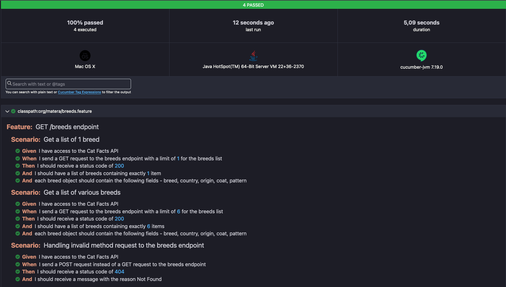

# Cat Facts API Testing

Este projeto consiste em uma suíte de testes automatizados para a API Cat Facts 🐈, utilizando Cucumber e RestAssured 
para garantir a funcionalidade e a segurança dos endpoints disponíveis.

### Pré-requisitos

Antes de começar, você precisará ter instalado:
- [Java JDK 11 ou superior](https://www.oracle.com/java/technologies/javase-jdk11-downloads.html), foi utilizado a JDK 22 neste projeto
- [Maven](https://maven.apache.org/)
- Um IDE, como [IntelliJ IDEA](https://www.jetbrains.com/idea/) ou [Eclipse](https://www.eclipse.org/)

### Instalação
#### 1. Clone o repositório:

```bash
git clone https://github.com/yuri-pires/desafio-tecnico-matera.git
cd desafio-tecnico-matera
```

#### 2. Compile e instale as dependências

```bash
 mvn clean install
```

> 🚩 Em caso de erros ao compilar o projeto, verique se sua váriavel JAVA_HOME está configurada corretamente no seu 
> sistema em `~/.bashrc` ou `~/.zshrc`. Ela é uma dependência direta do maven.
> 
> Caso prefira, basta localizar no arquivo `pom.xml` a váriavel `${java.version}`e substituir pela sua versão da JDK, tal
> como 21, 22, 23...


### Estrutura do Projeto

#### Testes
- **`src/test/java/org/matera`**: Contém as requisições HTTP do Rest Assured a API Cat Facts, *keywords*, e asserções a serem utilizada pelo Cucumber na classe `BredStepDefinition.java`.

> ℹ️ Neste arquivo utilizaremos das _kerywords_  em forma de **anotação** que o plugin do Cucumber nos oferece (_Given, When, Then..._), para associar as mesmas a funções do
Rest Assured que representam cada ação do usuário, tal como o exemplo:

```java
@Then("I should receive a status code of {int}")
public void iShouldReceiveAStatusCodeOf(int statusCode) {
response.then()
  .statusCode(statusCode);
}
```

#### Features

- **`src/test/resources/org/matera`**: Contém os arquivos de recursos do Cucumber, para o nosso teste temos o arquivo `breeds.feature`

> 🥒 Com o Cucumber, facilmente implementamos nossos _steps_ criados com as anotações nos métodos Java em um teste funcional
declarativo com a DSL Gherkin:

```gherkin
Feature: GET /breeds endpoint
  Scenario: Get a list of 1 breed
    Given I have access to the Cat Facts API
    When I send a GET request to the breeds endpoint with a limit of 1 for the breeds list
    Then I should receive a status code of 200
    And I should have a list of breeds containing exactly 1 item
    And each breed object should contain the following fields - breed, country, origin, coat, pattern
```

### Execução dos testes

Para rodar todos os testes do projeto execute o comando

```bash
mvn clean test
```

Este comando irá:
- Executar todos os **cenarios de teste funcional** no caminho `src/test/resources/org/matera/**.feature` com a _engine_ do `Cucumber`
- Após a execução dos testes, o `Cucumber` irá gerar um relatório `html` dos testes no caminho `/desafio-tecnico-matera/target/cucumber-reports/cucumber.html`
- Basta abrir o relatório no seu navegador e acompanhar o resultado dos testes:



### 🤝 Como Contribuir

- Relate Problemas: Abra um issue para bugs ou sugestões.
- Submeta Melhorias: Faça um pull request com suas mudanças.
- Documentação: Melhore ou corrija a documentação.


